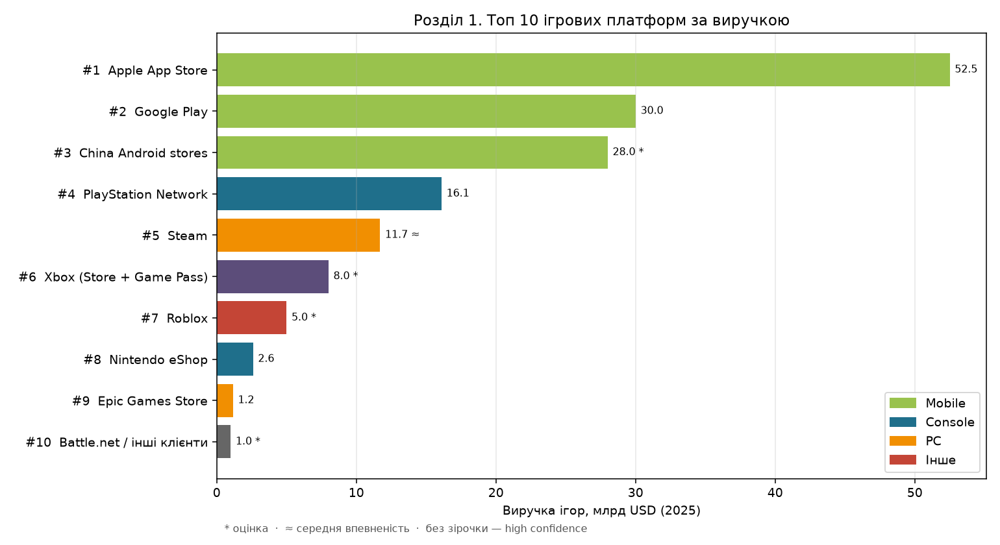
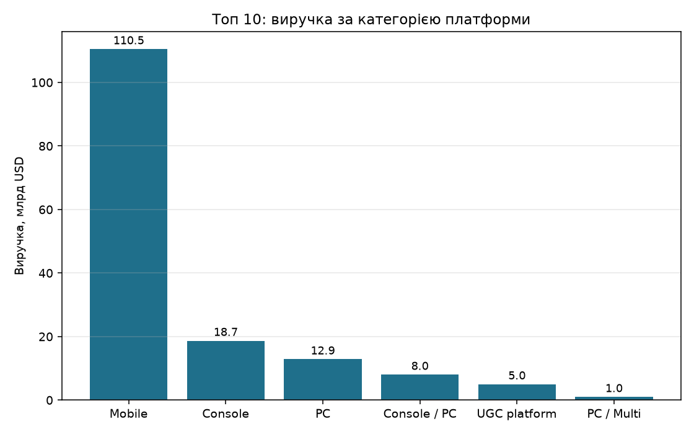
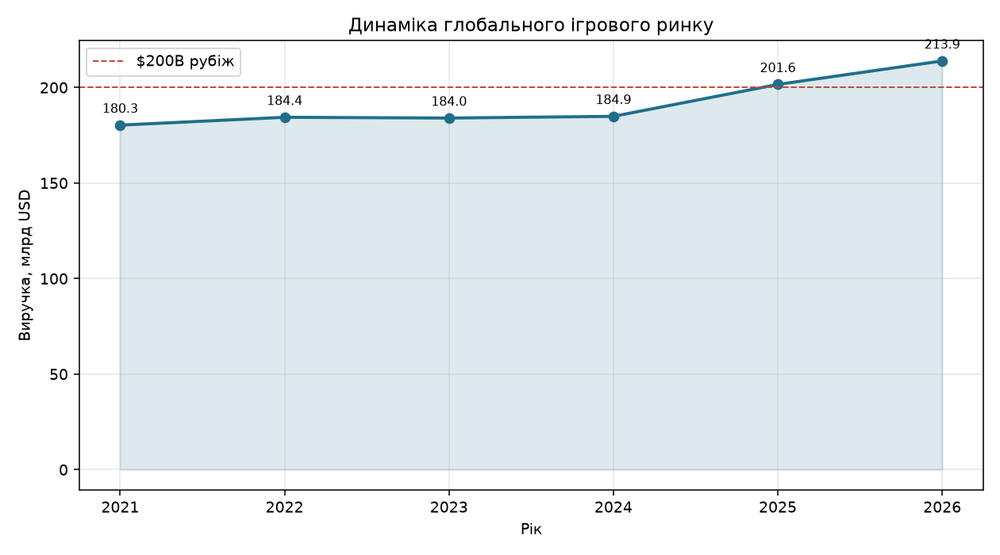
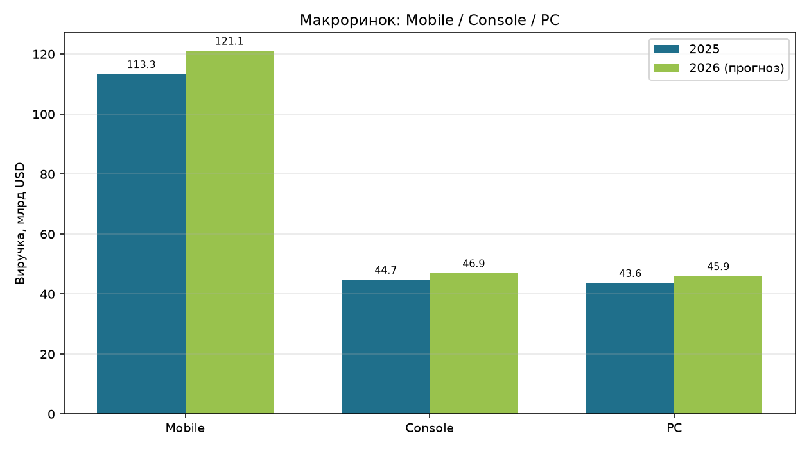
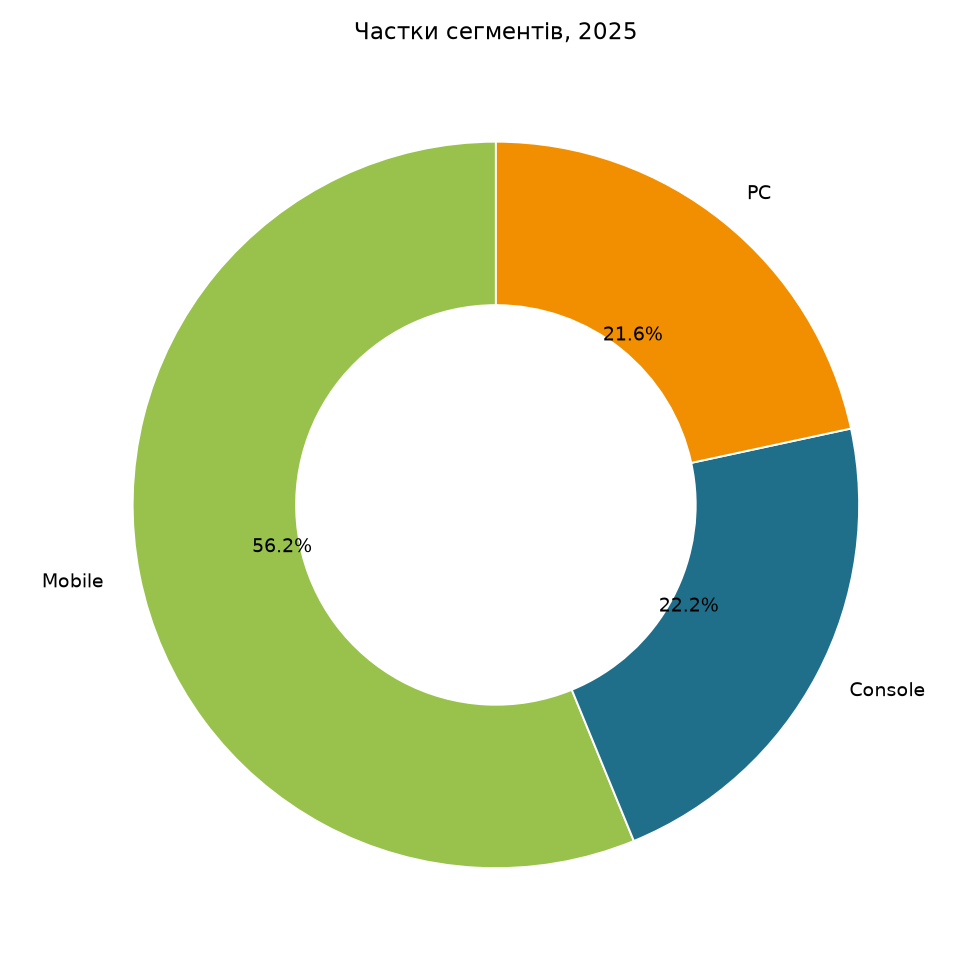
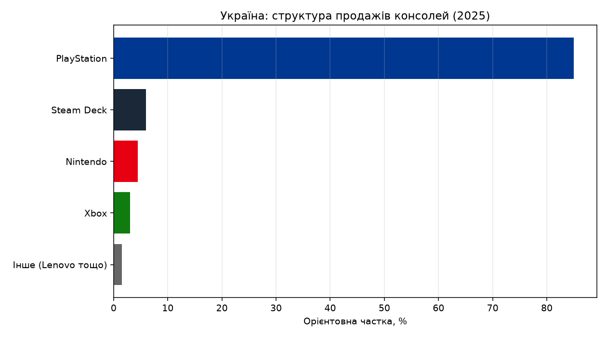

# Аналіз ігрового ринку

*Звіт згенеровано скриптом `game_market_analysis.py`.*

## Розділ 1. Топ 10 ігрових платформ

Ранжування за **виручкою ігор на платформі/сторфронті у 2025** (consumer spend на games). Де офіційних даних немає — оцінка (`confidence=estimate`).

- Сума топ-10 (tracked): **$156.1B**
- Топ-3 (App Store + Google Play + China Android): **71%** від tracked-суми
- Mobile у топ-10: **71%** виручки
- Найшвидший ріст у списку: **Nintendo eShop** (+25% YoY)
- High-confidence спостережень: **5/10**

| # | Платформа | Категорія | Виручка 2025 | YoY | Аудиторія | Confidence |
|---|-----------|-----------|--------------|-----|-----------|------------|
| 1 | **Apple App Store** | Mobile | $52.50BB | +0.6% | 850M середн. тижневих користувачів App Store | high |
| 2 | **Google Play** | Mobile | $30.00BB | -1% | 42.4B завантажень ігор у 2025 | high |
| 3 | **China Android stores** | Mobile | $28.00BB | +5% | агреговано (без Google Play у КНР) | estimate |
| 4 | **PlayStation Network** | Console | $16.10BB | +5.5% | 124M MAU (бер. 2025) | high |
| 5 | **Steam** | PC | $11.70BB | +13% | ~132–198M MAU (оцінки) | medium |
| 6 | **Xbox (Store + Game Pass)** | Console / PC | $8.00BB | +8% | Game Pass ~37M підписників | estimate |
| 7 | **Roblox** | UGC platform | $5.00BB | +20% | ~450M MAU | estimate |
| 8 | **Nintendo eShop** | Console | $2.60BB | +25% | Switch 2 >10M шт. у частковому 2025 | high |
| 9 | **Epic Games Store** | PC | $1.16BB | +6% | 78M MAU на PC | high |
| 10 | **Battle.net / інші клієнти** | PC / Multi | $1.00BB | +0% | фрагментовано (WoW, LoL client, Galaxy Store…) | estimate |

### Короткі профілі

**1. Apple App Store** (Apple) — Найбільший ігровий сторфронт у світі за виручкою IAP. Джерело: Sensor Tower / industry reports.

**2. Google Play** (Google) — Лідер за обсягом downloads; виручка нижча за iOS через ціни/ринки. Джерело: Sensor Tower.

**3. China Android stores** (Tencent / Huawei / Xiaomi / OPPO / Vivo / TapTap) — Фрагментований канал; критичний для global mobile top-grossing. Джерело: залишок Newzoo mobile мінус App Store/GP.

**4. PlayStation Network** (Sony) — Лише digital software/add-on; Network Services (~$5.1B) окремо. Джерело: Sony FY2025 digital software + add-on (¥2.415T).

**5. Steam** (Valve) — Найшвидший ріст серед великих PC/console сторів (+13%); ~75% PC digital. Джерело: Sensor Tower; MAU — GameDiscoverCo / DSA EU.

**6. Xbox (Store + Game Pass)** (Microsoft) — Підписка — ядро екосистеми; hardware слабший за PS. Джерело: Game Pass ~$5B + оцінка digital store.

**7. Roblox** (Roblox Corporation) — І гра, і платформа; домінує в cross-platform engagement. Джерело: engagement Sensor Tower; bookings — орієнтир.

**8. Nintendo eShop** (Nintendo) — Digital ~55% software; first-party IP тримає виручку. Джерело: Nintendo digital software FY (~¥408B / ~$2.6B).

**9. Epic Games Store** (Epic Games) — 3P spending +57% до $400M; без D2C Fortnite/Marvel Rivals тощо. Джерело: Epic Games Store 2025 Year in Review.

**10. Battle.net / інші клієнти** (Blizzard / Riot / Amazon / Samsung) — Включно з Galaxy Store, Amazon Appstore, itch.io тощо. Джерело: агрегований орієнтир second-tier storefronts.

### Інсайти розділу 1

1. **Mobile-сторфронти займають три перші місця** і генерують більшість tracked-виручки — App Store сам майже дорівнює Google Play + China Android.
2. **PlayStation Network випереджає Steam за digital software revenue** (~$16B vs $11.7B), але Steam швидше росте (+13%) і домінує на PC.
3. **Xbox тримається на Game Pass** (~$5B підписка + store), не на hardware.
4. **Epic** малий за store spend ($1.16B), але важливий як D2C/free-games і як Unreal/Epic ecosystem; 78M MAU на PC.
5. **Roblox** — окремий клас UGC-платформи з гігантським MAU (~450M), який конкурує з «класичними» сторами за увагу гравців.

---

## Розділ 2. Макроринок (Newzoo)

У **2025** глобальний ігровий ринок: **$201.6B** (+9.1% YoY). Прогноз **2026**: **$213.9B** (+6.1% YoY). Домінує **Mobile** ($121.1B).

| Сегмент | 2025, $B | Ріст 2025 | 2026, $B | Ріст 2026 | Частка 2026 |
|---------|----------|-----------|----------|-----------|-------------|
| Mobile | 113.3 | +10.7% | 121.1 | +6.8% | 56.6% |
| Console | 44.7 | +2.8% | 46.9 | +5.1% | 21.9% |
| PC | 43.6 | +12.0% | 45.9 | +5.3% | 21.5% |

- Найшвидше у 2025: **PC** (+12.0%).
- Найшвидше у 2026 (прогноз): **Mobile** (+6.8%).
- CAGR 2021–2026: **3.5%**.

### Драйвери 2026

1. **GTA VI** — каталізатор console full-game spending.
2. **Mobile D2C / ARPPU** — зростання через витрати платників.
3. **PC сповільнення** після +12% у 2025 (дорожча пам’ять, висока база).

---

## Розділ 3. Монетизація

| Модель | Орієнтовна частка |
|--------|-------------------|
| In-game / live service | 52% |
| Full-game (premium) | 28% |
| Subscriptions | 14% |
| Інше | 6% |

Live-service лишається основою виручки; premium/full-game у 2026 прискорюється завдяки GTA VI (~+17.5% full-game на консолях).

---

## Розділ 4. Український контекст

### Споживчий ринок (DOU / ERC, 2025)

- Фізичні ігри на дисках: **-14%** YoY.
- Ринок консолей: **+14%** YoY.
- **PlayStation > 85%** продажів консолей; далі Steam Deck, Nintendo, Xbox.
- S.T.A.L.K.E.R. 2 — лідер фізичних продажів у кількох місяцях 2025.

### Продуктовий геймдев (DOU 2025)

| Платформа | Студій у топ-20 |
|-----------|-----------------|
| Mobile | 14 |
| PC | 12 |
| Console / multi | 4 |

- Mobile — головний фокус українських продуктових студій.
- Unity — найпоширеніший рушій (11/20).
- Тренди 2026: AI у продакшні/UA, retention > інсталяції, гібридна монетизація.

---

## Розділ 5. Висновки

1. **Топ-платформи = mobile stores** за виручкою; **Steam/PSN** — якір PC/console.
2. Стратегія релізу: scale → App Store / Google Play / China; premium IP → PSN + Steam (+ Xbox Game Pass для reach).
3. **2026** — рік console-каталізатора (GTA VI) і AI-пайплайнів у mobile.
4. В Україні — digital-first + PS-домінування; для студій — mobile live-ops + PC mid-core.

## Усі графіки

## Джерела

- Sensor Tower / industry reports — App Store $52.5B, Google Play $30B, Steam $11.7B (2025)
- [Sony FY2025 G&NS](https://www.sony.com/en/SonyInfo/IR/library/presen/business_segment_meeting/pdf/2025/GNS_E.pdf) — PSN 124M MAU; digital software ¥2.415T
- [Epic Games Store 2025 Year in Review](https://store.epicgames.com/en-US/news/epic-games-store-2025-year-in-review)
- Nintendo digital software / eShop FY figures (~$2.1–2.6B)
- [Newzoo — $213.9B на 2026](https://www.gamesindustry.biz/newzoo-global-games-market-to-generate-2139bn-in-2026-up-61-yoy)
- [DOU — ринок України 2025](https://gamedev.dou.ua/articles/best-selling-games-in-ukraine-2025/)

> Примітка: виручка платформ — games consumer spend на сторі/екосистемі. Не плутати з publisher revenue. Hardware, ads і secondary markets виключені там, де джерело це дозволяє.
