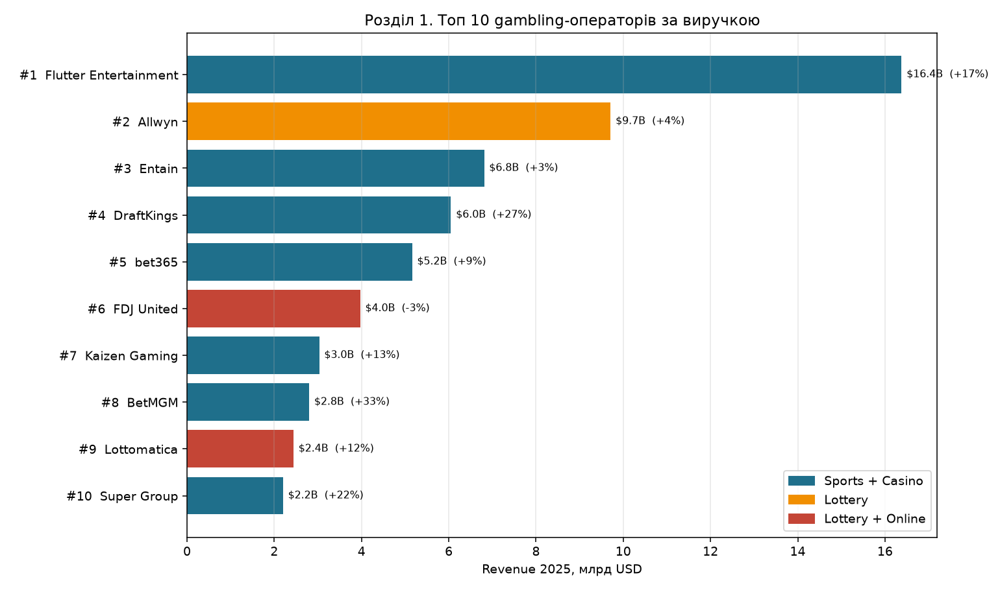
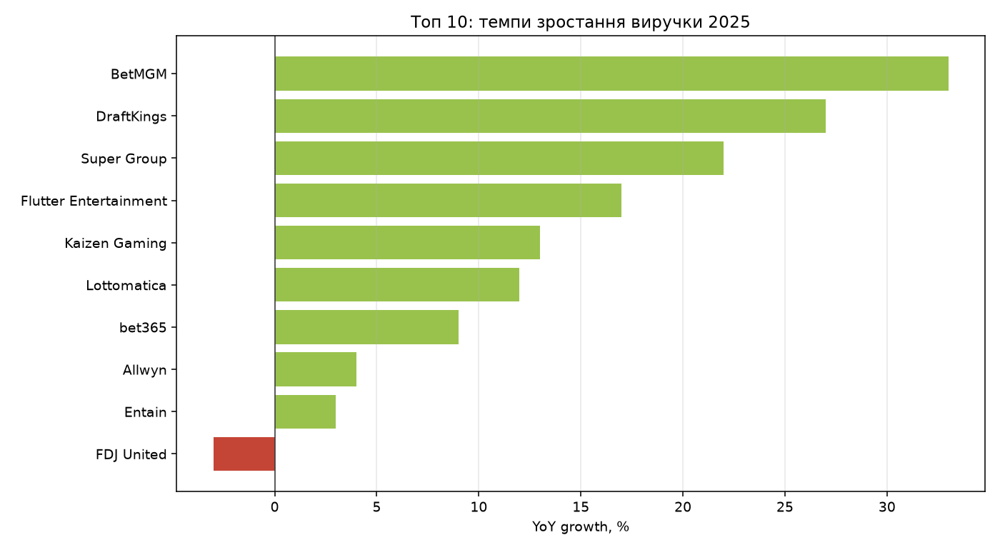
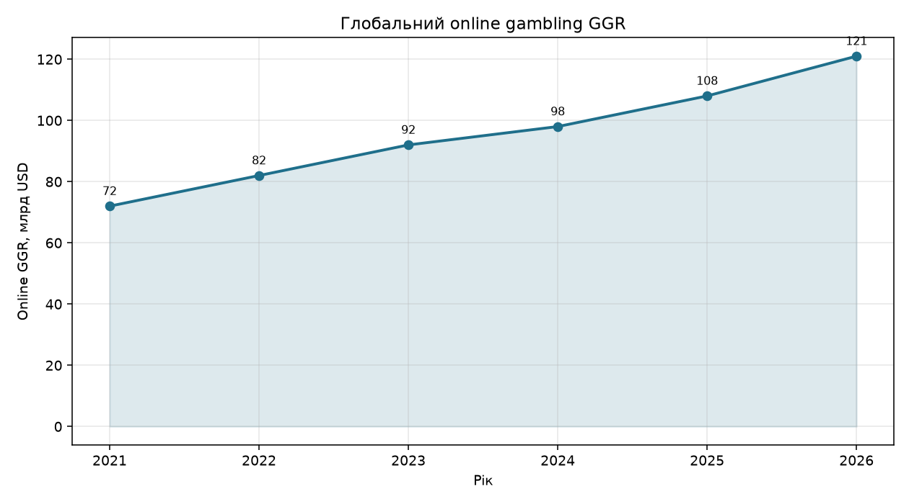
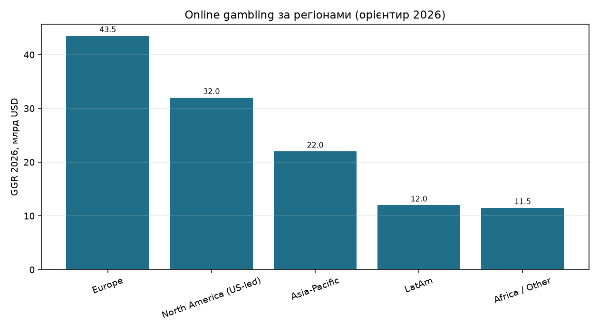
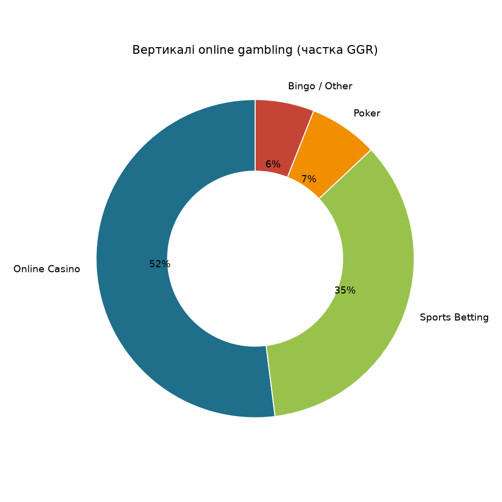
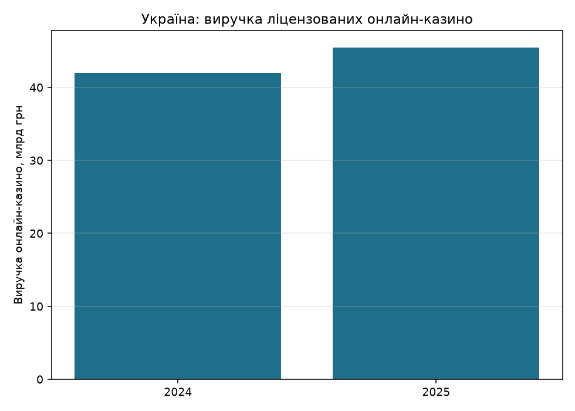

# Аналіз ринку гемблінгу (iGaming)

*Звіт згенеровано скриптом `game_market_analysis.py`.*

## Розділ 1. Топ 10 ігрових платформ (gambling-оператори)

Ранжування за **group revenue 2025** (не GGR). Бренди в дужках — ключові продукти оператора.

- Сума топ-10: **$58.6B** revenue
- Частка топ-3: **56%** від суми топ-10
- Sports+Casino брендів у списку: **7** ($42.4B)
- Найшвидший ріст: **BetMGM** (+33% YoY)
- Середній YoY по топ-10: **+13.7%**

| # | Оператор | Бренди | Категорія | Revenue 2025 | YoY |
|---|----------|--------|-----------|--------------|-----|
| 1 | **Flutter Entertainment** | FanDuel, Paddy Power, Betfair, PokerStars, Sisal, Snai | Sports + Casino | $16.38B | +17% |
| 2 | **Allwyn** | лотереї / multi-jurisdiction lottery | Lottery | $9.71B | +4% |
| 3 | **Entain** | bwin, Coral, Ladbrokes, partypoker (+ BetMGM JV окремо) | Sports + Casino | $6.81B | +3% |
| 4 | **DraftKings** | DraftKings Sportsbook, Casino, DFS | Sports + Casino | $6.05B | +27% |
| 5 | **bet365** | bet365 | Sports + Casino | $5.16B | +9% |
| 6 | **FDJ United** | FDJ, Kindred assets (Unibet тощо) | Lottery + Online | $3.97B | -3% |
| 7 | **Kaizen Gaming** | Betano, Stoiximan | Sports + Casino | $3.03B | +13% |
| 8 | **BetMGM** | BetMGM | Sports + Casino | $2.8B | +33% |
| 9 | **Lottomatica** | Lottomatica / Italy retail+online | Lottery + Online | $2.44B | +12% |
| 10 | **Super Group** | Betway, Spin | Sports + Casino | $2.2B | +22% |

### Профілі

**1. Flutter Entertainment** — Світовий №1 online operator; US (FanDuel) — ключовий драйвер росту Аудиторія/масштаб: 15.9M Average Monthly Players. Джерело: Flutter FY2025 / 10-K ($16.38B).

**2. Allwyn** — Lottery-модель: великий top-line, інша економіка ніж sportsbook Аудиторія/масштаб: lottery-led group (GGR ≈ revenue scale). Джерело: The iGaming EU 2025 ranking (€8.99B).

**3. Entain** — Зрілий EU/UK портфель; зростання стримане vs US peers Аудиторія/масштаб: UK/EU retail+online; US через BetMGM JV. Джерело: Entain FY2025 / ranking (€6.31B; US часто окремо).

**4. DraftKings** — Один із найшвидших серед топ-операторів; US sportsbook war Аудиторія/масштаб: US-focused; перший повний рік net profit. Джерело: DraftKings FY2025 ($6.05B).

**5. bet365** — Найбільший приватний оператор; сильний in-play sportsbook Аудиторія/масштаб: private; global sports-led brand. Джерело: bet365 FY to Mar 2025 (~€4.78B / £4.04B).

**6. FDJ United** — На GGR виглядає більшим за revenue-line (lottery accounting) Аудиторія/масштаб: France lottery core + international online. Джерело: FDJ United FY2025 (€3.68B revenue; GGR вищий).

**7. Kaizen Gaming** — Активна експансія в Бразилії та регульованих ринках Аудиторія/масштаб: EU + LatAm (Brazil Betano). Джерело: The iGaming EU 2025 (€2.81B).

**8. BetMGM** — Найшвидший ріст у топ-10; №3 у US sportsbook race Аудиторія/масштаб: US JV MGM × Entain; +EBITDA. Джерело: BetMGM FY2025 (~$2.8B).

**9. Lottomatica** — Сильний домашній ринок Італії; hybrid retail/online Аудиторія/масштаб: Italy-focused; GGR > reported revenue. Джерело: Lottomatica FY2025 (€2.26B).

**10. Super Group** — Швидке зростання поза зрілою Європою Аудиторія/масштаб: multi-region online; Africa + Americas focus. Джерело: Super Group FY2025 ($2.2B).

### Інсайти розділу 1

1. **Flutter домінує з відривом** (~$16.4B) — майже як DraftKings + Entain разом.
2. **Найшвидше ростуть US-бренди**: BetMGM (+33%), DraftKings (+27%), плюс Super Group (+22%) поза зрілою Європою.
3. **Lottery-оператори (Allwyn, FDJ, Lottomatica)** на revenue-line виглядають інакше, ніж на GGR — для apples-to-apples порівнюйте GGR окремо.
4. **Консолідація триває**: топ-оператори забирають дедалі більшу частку регульованого GGR (Track360: top-10 ~42% regulated GGR).
5. Для України релевантні не глобальні гіганти напряму, а **локальні ліцензовані бренди** + B2B (Evolution тощо) як постачальники контенту.

---

## Розділ 2. Макроринок online gambling

- **2025 GGR:** ~**$108B**
- **2026 GGR (прогноз):** ~**$121B** (+12% YoY)
- **CAGR 2021–2026:** ~**10.9%**
- Найбільша вертикаль: **Online Casino** (52%)
- Найбільший регіон: **Europe** (~$43.5B)

- Регульований ринок: **~68%** GGR
- Mobile: **~72%** online revenue
- США — найбільша країна (~$27.4B online GGR у 2025)
- LatAm — найшвидший великий регіон (Brazil regulated ramp)

---

## Розділ 3. Вертикалі та канали

| Вертикаль | Частка GGR | GGR 2026 (орієнтир) |
|-----------|------------|---------------------|
| Online Casino | 52% | $63.0B |
| Sports Betting | 35% | $42.5B |
| Poker | 7% | $8.1B |
| Bingo / Other | 6% | $6.9B |

| Канал | Частка |
|-------|--------|
| Mobile | 72% |
| Desktop / Other | 28% |

| Регуляція | Частка | GGR 2026 |
|-----------|--------|----------|
| Regulated | 68% | $82.7B |
| Grey / Unregulated | 32% | $38.3B |

---

## Розділ 4. Український ринок

- Регулятор: **PlayCity** (замість КРАІЛ).
- Виручка ліцензованих онлайн-казино **2025:** **45.5 млрд грн** (+8% vs 2024 / 42 млрд грн) — YouControl.
- У реєстрі: **30** онлайн-казино; анульовано **8**, призупинено **2**.
- До бюджету 2025: ~**19 млрд грн** (ліцензії + податки + лотереї).
- Заблоковано **>3500** нелегальних сайтів.
- Орієнтир лідера 2024: Favbet (~21.2 млрд грн виручки у 2024).

Ринок стабілізується після бурхливої легалізації: нових ліцензій у 2025 мало (2), акцент зміщується на контроль, блокування сірого ринку та цифрові ліцензії.

---

## Розділ 5. Висновки

1. **Глобальний online gambling ~$108→$121B GGR** — зростання двознакове, драйвери: US, Brazil, mobile.
2. **Топ-платформи = Flutter / Allwyn / Entain / DraftKings / bet365**; швидкість росту вища в US і emerging markets.
3. **Casino лишається найбільшою вертикаллю**, sports betting — найдинамічніша в нових юрисдикціях.
4. **Україна** — регульований, але ще консолідаційний ринок (~45.5 млрд грн онлайн-казино); compliance і боротьба з нелегалами — головна тема 2026.
5. Можливості: ліцензований product + localized payments; ризики — регуляторний тиск, advertising bans, санкційні списки.

## Усі графіки

## Джерела

- [Track360 — Online Gambling Statistics 2026](https://track360.io/blog/online-gambling-statistics-2026-global-market-data)
- [Track360 — iGaming Q1 2026 / top operators](https://track360.io/blog/igaming-industry-statistics-q1-2026-report)
- [The iGaming EU — 2025 revenue ranking](https://theigaming.eu/2026/04/12/2025-gambling-revenue-15-largest-companies-ranked/)
- [GamblingClub — top companies 2025](https://gamblingclub.be/en/flutter-remains-worlds-largest-gambling-company/)
- Flutter Entertainment FY2025 / 10-K
- [YouControl / Fair — онлайн-казино України 2025](https://www.fair.org.ua/eksperty-ozvuchyly-dani-shhodo-zrostannya-rynku-igaming-v-ukrayini/)
- PlayCity / Delo.ua — бюджет і блокування нелегалів 2025

> Примітка: **Revenue ≠ GGR**. Lottery-оператори часто мають вищий GGR за нижчий net revenue. Цифри сірих ринків — оцінки.
